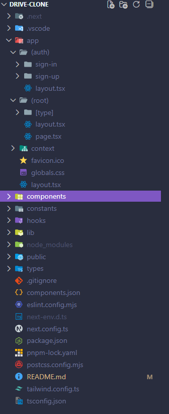
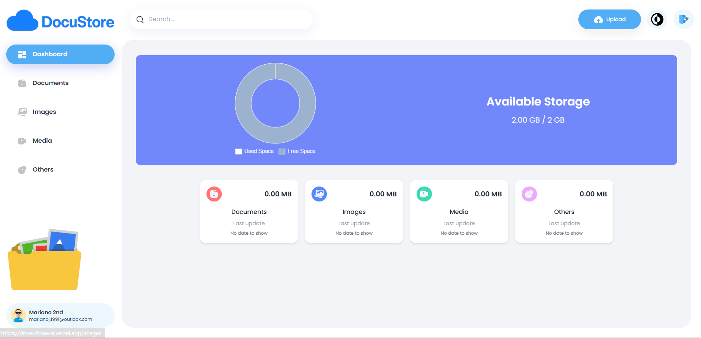
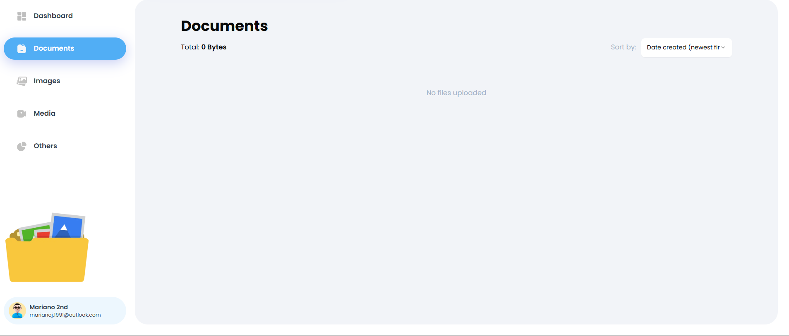
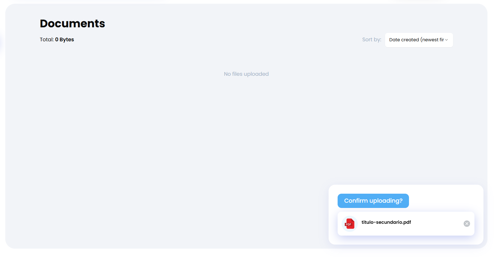
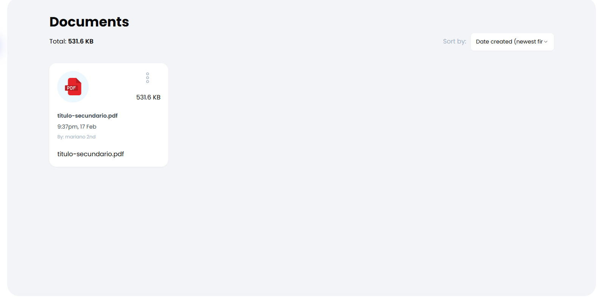
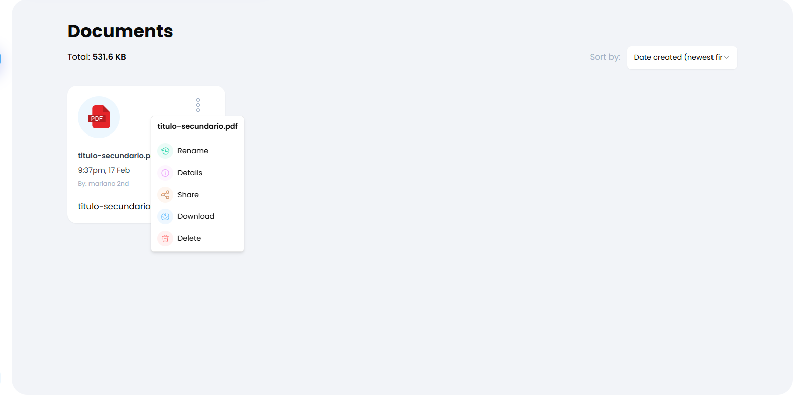
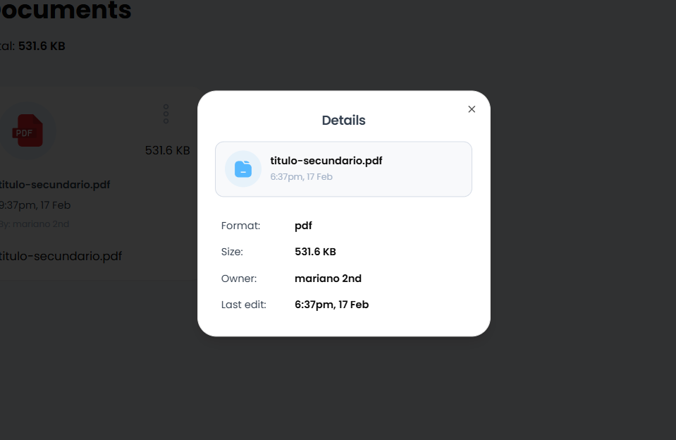
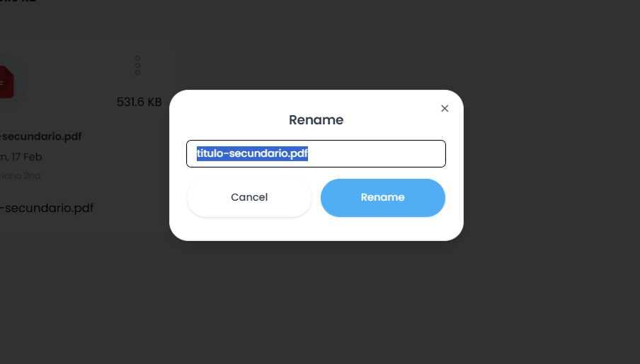
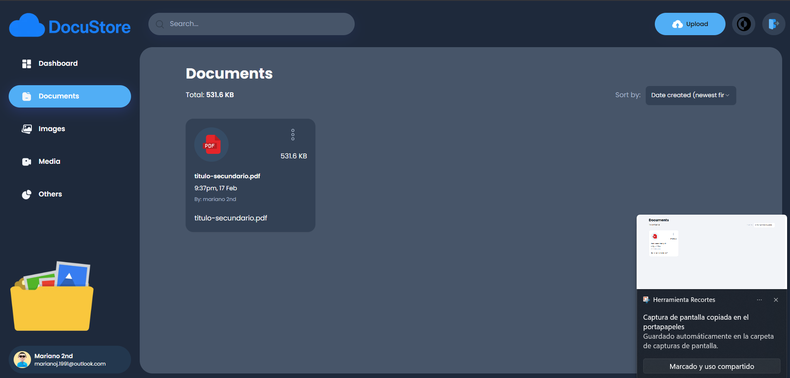

# 📂 Drive Clone App

Aplicación web tipo clon de Google Drive desarrollada con **Next.js 15**, utilizando **Appwrite** como servicio de autenticación y base de datos.

## 🚀 Tecnologías utilizadas

- [Next.js 15](https://nextjs.org/)
- [Appwrite](https://appwrite.io/) para autenticación y almacenamiento de datos
- [TypeScript](https://www.typescriptlang.org/) para tipado estático
- [Tailwind CSS](https://tailwindcss.com/) para estilos (si corresponde)

## 📱 Funcionalidades principales

- **Autenticación segura** con Appwrite (sign in / sign out).
- **Subida de archivos** al sistema.
- **Filtrado por tipo de archivo** (documentos, imágenes, etc.).
- **Vista detallada** de cada archivo con metadatos.
- **Eliminación de archivos** desde la interfaz.
- **Dashboard informativo** con métricas de espacio ocupado y estadísticas de uso.

## 🌐 Deploy

La aplicación está desplegada en Vercel:  
👉 [Drive Clone App](https://drive-clone-xi.vercel.app/sign-in)

## ⚙️ Instalación y ejecución

1. Clonar el repositorio:
   ```bash
   git clone https://github.com/tuusuario/drive-clone-app.git
   cd drive-clone-app
   ```
2. Instalar dependencias:
   ```bash
   pnpm install
   ```
3. Configurar variables de entorno en .env.local:
   ```bash
   NEXT_PUBLIC_APPWRITE_ENDPOINT
   NEXT_PUBLIC_APPWRITE_PROJECT
   NEXT_PUBLIC_APPWRITE_DATABASE
   NEXT_PUBLIC_APPWRITE_USERS_COLLECTION
   NEXT_PUBLIC_APPWRITE_BUCKET
   NEXT_PUBLIC_APPWRITE_FILES_COLLECTION
   NEXT_APPWRITE_KEY
   ```
4. Ejecutar en desarrollo:
   ```bash
   pnpm run dev
   ```

## 📸 Estructura de carpetas



## 📸 Capturas de pantalla

### Dashboard



### Documents



### Uploading



### Uploaded



### Document Options



### Document Option Selected Example




### DarkMode


